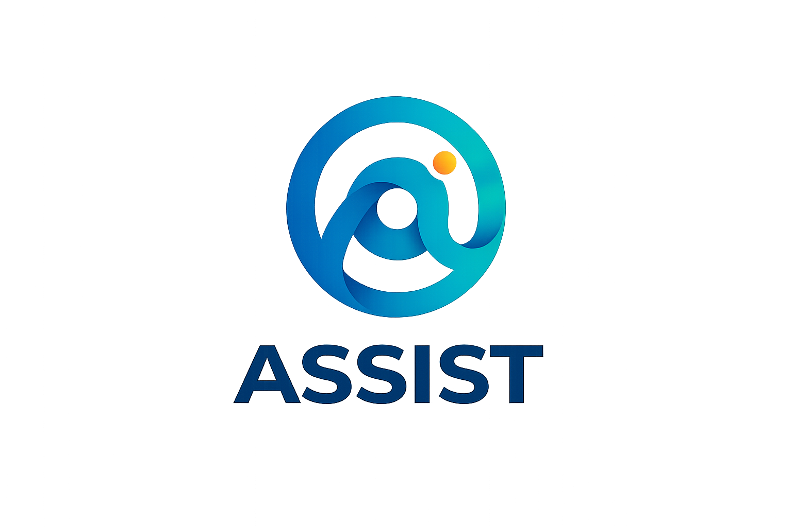

<p align="center">
  
</p>

<p align="center">
  A local-first AI workspace for Windows — chat, agents, deep research, documents,
  email, calendar, notes, local LLM &amp; image-model serving, voice, and desktop
  automation. Your data and your models stay on your machine.
</p>

<p align="center">
  <a href="#quick-start">Quick Start</a> ·
  <a href="docs/setup.md">Setup Guide</a> ·
  <a href="CONTRIBUTING.md">Contributing</a> ·
  <a href="ROADMAP.md">Roadmap</a>
</p>

<p align="center">
  
</p>

---

## What is Assist?

Assist is a self-contained AI workspace that runs entirely on your own computer.
Point it at any OpenAI-compatible API (OpenAI, Anthropic, Groq, OpenRouter, a
local server, …) **or** download and run models fully offline — LLMs and image
models both. It ships as a **native Windows app** (one installer, no Docker, no
Python setup) and can also be self-hosted with Docker on any platform.

The interface is a single window with a chat-first workspace and dedicated tools
for research, documents, email, calendar, tasks, notes, a gallery/image editor,
memory, and local-model management.

## Quick Start

### Windows (recommended)

Download and run **`Assist-Setup.exe`** from the
[latest release](https://github.com/xbxhkz/Assist/releases), then launch **Assist**
from the Start menu. Everything is bundled — the local model runtimes
(`llama.cpp`, `stable-diffusion.cpp`), the offline speech-to-text engine, and the
embedding model. No account is required to start; the first launch creates a local
admin login.

### Self-host (Docker, any OS)

```bash
git clone https://github.com/xbxhkz/Assist.git
cd Assist
cp .env.example .env
docker compose up -d --build
```

Open `http://localhost:7000` when the containers are healthy; the first admin
password is printed in `docker compose logs`. GPU notes, HTTPS, macOS/Linux
specifics, and configuration live in the [setup guide](docs/setup.md).

## Features

### Chat &amp; Agents
- **Chat** — a plain conversation with any local or API model, with a model picker
  at the top of the composer.
- **Agent** — the model gains tools: web search, files, email, calendar, notes,
  documents, image generation, shell, desktop control, model management, and more.
  Toggle tools per-turn; slash commands (`/`) offer quick actions.
- **Skills** — teach the agent reusable multi-step workflows; import community
  skills from GitHub or have the agent save one from the current chat.
- **Memory (Brain)** — persistent facts it learns about you, tidy suggestions, and
  semantic recall.
- **Connectors (MCP)** — link external services (Gmail, Google Calendar, Google
  Drive, Hugging Face, and any Model Context Protocol server) from Settings.

### Local models — no account needed
- **LLMs** — search Hugging Face for GGUF models, download or link them, and serve
  on **CPU** or **GPU**. The GPU path uses a Vulkan build with automatic
  fill-and-spill: it keeps as much of the model in VRAM as fits and streams the
  rest from RAM, so models larger than your card can still run. Hardware-aware
  recommendations rank downloads to fit your machine.
- **Image generation** — serve diffusion models locally via bundled
  `stable-diffusion.cpp`:
  - **FLUX.1** (12B), **FLUX.2 klein** (distilled, 4 steps — fast default),
    **Z-Image turbo** (6B), **SDXL** checkpoints (Juggernaut, RealVisXL), and
    **Chroma** (an uncensored, de-distilled FLUX finetune).
  - **LoRA manager** — search and download LoRAs from Civitai / Hugging Face and
    apply them with a `<lora:name:weight>` prompt tag.
  - VRAM fill-and-spill lets ~12 GB models generate on a 6 GB card.
- **Gallery** — albums, favorites, and an editor (crop, adjustments, background
  removal). Images generated in chat are saved automatically.

### Voice
- **Hands-free voice conversations** — click the voice button and talk: offline
  **Whisper** speech-to-text transcribes you, auto-submits, and the reply is spoken
  aloud, then the mic re-opens for the next turn. Voice-activity detection ends each
  turn automatically. Configure providers in Settings → Services.

### Desktop control &amp; automation (admin-only)
- **Desktop tools** — launch apps, find files, list/control windows, and capture
  the screen (with a sidebar consent toggle that resets off on every restart).
- **Vision** — pair screen capture with a local vision model to read the screen.
- **Input automation** — mouse and keyboard control via the Windows input stack.
- **Network scanner** — private-network host discovery and port scanning
  (guarded to private ranges).
- **AI Operator** — give a goal and let the agent drive the desktop in a
  perceive-act loop, with per-action human confirmation.
- **Shell** — let the agent run **PowerShell / cmd** commands behind a consent
  switch: read-only commands auto-run, state-changing ones require your approval.

### Research, comparison &amp; productivity
- **Deep Research** — multi-step web research that reads sources and writes a report.
- **Compare** — blind side-by-side model testing and synthesis.
- **Documents / Library** — a writing-first editor with AI edits and suggestions;
  PDFs get previews and RAG search.
- **Email** — IMAP/SMTP inbox with triage, tags, summaries, reminders, and reply
  drafts.
- **Calendar, Tasks &amp; Notes** — events, CalDAV sync, background agent tasks on a
  schedule, and quick notes.
- **Hardware monitor** — a collapsible sidebar panel with live CPU / RAM / per-GPU
  VRAM and utilization sparklines.

### Extras
Themes and a live theme editor, image/file uploads, web search providers, presets,
multi-session chats, and TOTP two-factor auth.

## Help &amp; tutorials

In-app help lives behind the **?** button: a detailed **Manual** covering every
feature, interactive **Tutorials** (walkthroughs that run in the chat window), and
an **About** panel. Type `/help` in the composer for slash commands, or `/setup`
to connect a provider.

## Configuration

Environment variables use the `ASSIST_*` prefix (e.g. `ASSIST_ADMIN_USER`,
`ASSIST_DATA_DIR`). The legacy `ODYSSEUS_*` names are still honored for backward
compatibility. On Windows, data and logs live under `~/.assist/data`.

## Security

Assist is a local workspace with powerful tools — shell execution, desktop
control, and input automation are all **admin-only** and gated behind explicit
consent toggles that default off. Keep auth enabled, keep private data out of Git,
and do not expose raw model/service ports publicly. Details are in the
[setup guide](docs/setup.md#security-notes).

## License

AGPL-3.0-or-later — see [LICENSE](LICENSE) and [ACKNOWLEDGMENTS.md](ACKNOWLEDGMENTS.md).
